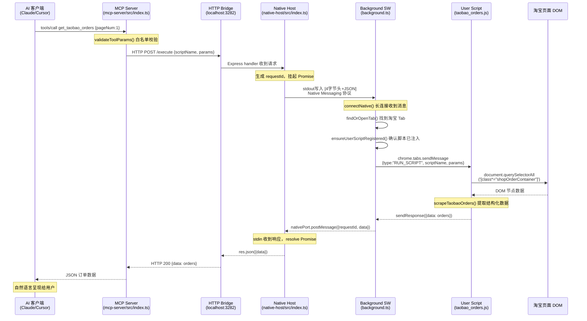

# Browser MCP Platform — 架构与原理解析

## 1. 整体架构与执行流程

### 系统组成

项目由三个独立运行的进程和一个浏览器插件组成：

| 组件 | 运行环境 | 启动方式 |
|------|----------|----------|
| MCP Server | Node.js 进程 | Claude Desktop / Cursor 通过 Stdio 启动 |
| Native Host | Node.js 进程 | Chrome 通过 Native Messaging 协议自动拉起 |
| Chrome Extension | Chrome Service Worker | 浏览器启动时加载 |
| User Script | 页面沙箱 | 目标页面加载时由 userScripts API 注入 |

### 生命周期

**初始化阶段**

1. Chrome 启动，加载 Extension，`background.ts` 中的 `connectNative()` 被调用
2. Chrome 根据 `~/Library/Application Support/Google/Chrome/NativeMessagingHosts/com.browsermcp.host.json` 找到 `start.sh`，拉起 Native Host 进程
3. Native Host 启动后：
   - `startChromeListener()` 监听 stdin（Chrome 的 Native Messaging 管道）
   - `startHttpServer()` 在 `127.0.0.1:3282` 启动 HTTP Server
4. Service Worker console 打印 `[BrowserMCP] Native Messaging 已连接`
5. `onInstalled` 事件触发，调用 `chrome.userScripts.configureWorld({ messaging: true })`，开启沙箱内的 `chrome.runtime` 通信能力

**请求处理阶段**

1. 用户在 AI 客户端（Claude Desktop / Cursor）发起自然语言请求
2. AI 识别意图，调用 MCP Tool（如 `get_taobao_orders`）
3. MCP Server 的 `CallToolRequestSchema` handler 被触发
4. `validateToolParams()` 对参数做白名单校验
5. `callNativeHost()` 通过 HTTP POST 发送到 `localhost:3282/execute`
6. Native Host 的 Express handler 收到请求，生成 `requestId`，通过 `writeToChrome()` 写入 stdout
7. Chrome 收到 Native Messaging 消息，`background.ts` 的 `onMessage` 触发
8. `executeScript()` 找到目标 Tab，调用 `chrome.tabs.sendMessage`
9. 页面内的 User Script 通过 `chrome.runtime.onMessage` 收到消息，执行 DOM 抓取
10. 结果原路返回，MCP Server 将 JSON 数据返回给 AI

---

## 2. 数据链路剖析

### Mermaid 时序图



### 数据转换过程

```
DOM 原始节点
    ↓ scrapeTaobaoOrders()
{ orderId, shop, status, createTime, items[] }
    ↓ sendResponse / postMessage / HTTP
{ data: { total, orders[] } }
    ↓ MCP Server JSON.stringify
{ content: [{ type: "text", text: "..." }] }
    ↓ MCP Protocol
AI 自然语言输出
```

---

## 3. 核心代码结构映射

```
browser-mcp/
├── mcp-server/src/
│   ├── index.ts          # MCP Server 入口，注册 tools/list 和 tools/call handler
│   ├── tools.ts          # TOOL_DEFINITIONS 工具声明 + validateToolParams() 白名单校验
│   └── http-bridge.ts    # callNativeHost() 封装 HTTP POST，含 30s 超时控制
│
├── native-host/src/
│   └── index.ts          # 双重职责：
│                         #   startChromeListener() — Native Messaging stdin/stdout 读写
│                         #   startHttpServer()     — Express HTTP Server 监听 3282
│                         #   pendingRequests Map   — requestId → Promise 映射，实现异步桥接
│
├── chrome-extension/
│   ├── manifest.json     # 声明 nativeMessaging + userScripts 权限，指定 Service Worker
│   ├── background.ts     # connectNative() 长连接管理
│                         # executeScript() 路由到目标 Tab
│                         # ensureUserScriptRegistered() 懒注册 User Script
│                         # findOrOpenTab() Tab 生命周期管理
│   └── popup/
│       ├── popup.html    # 脚本管理 UI
│       └── popup.ts      # 安装/删除脚本，调用 chrome.userScripts.register()
│
├── scripts/
│   ├── taobao_orders.js  # User Script：chrome.runtime.onMessage 监听
│                         # scrapeTaobaoOrders() DOM 抓取订单数据
│   └── jd_orders.js      # 京东订单抓取脚本（同上模式）
│
└── native-host/
    └── manifest.json     # Native Messaging Host 注册文件
                          # 声明 allowed_origins（插件 ID 白名单）
```

---

## 4. 关键机制与难点

### 4.1 双进程架构解决 Stdio 冲突

这是本项目最核心的架构决策。

**问题**：MCP Server 和 Native Host 都依赖 Stdio 通信，但协议完全不同：
- MCP Server 的 Stdio：JSON-RPC 协议，由 Claude Desktop 管理
- Native Host 的 Stdio：4字节小端序长度头 + JSON，由 Chrome 管理

如果合并为一个进程，两套协议会争抢同一个 stdin/stdout，导致双方都无法正常解析数据。

**解决方案**：拆分为两个独立进程，通过 `localhost:3282` HTTP 做进程间通信（IPC）。Native Host 的 stdout 专用于 Chrome 通信，MCP Server 的 Stdio 专用于 AI 客户端通信，互不干扰。

### 4.2 requestId 异步桥接

Native Host 中的 `pendingRequests: Map<string, {resolve, reject}>` 是实现异步桥接的关键：

```
HTTP 请求到达
    → 生成 requestId
    → new Promise((resolve, reject) => pendingRequests.set(requestId, {resolve, reject}))
    → writeToChrome() 发出指令（不阻塞）
    → 等待 Chrome 回传

Chrome 回传数据
    → stdin 解析出 requestId
    → pendingRequests.get(requestId).resolve(data)
    → HTTP Response 返回
```

这个模式将 Native Messaging 的异步回调转换为 Promise，使 Express handler 可以用 `await` 等待结果。

### 4.3 User Script 沙箱通信

Chrome MV3 的 `userScripts` API 将脚本运行在独立的 `USER_SCRIPT` world 中，与页面的 `MAIN` world 和插件的 `ISOLATED` world 完全隔离。

**关键配置**：必须在 `onInstalled` 时调用：
```javascript
chrome.userScripts.configureWorld({ messaging: true })
```

只有开启 `messaging: true`，沙箱内的脚本才能使用 `chrome.runtime.onMessage`。否则 `chrome.runtime` 在沙箱内为 `undefined`，`background.ts` 发出的 `chrome.tabs.sendMessage` 永远收不到响应。

### 4.4 参数白名单防注入

`validateToolParams()` 在 MCP Server 层做严格校验，拒绝任何 `TOOL_DEFINITIONS` 中未声明的参数字段。这防止了两类风险：
- **AI 幻觉**：模型生成了不存在的参数名
- **提示词注入**：恶意网页内容通过 AI 上下文传入非法参数，试图扩大执行范围

所有到达 Chrome 插件的指令，参数集合已被严格限定在白名单内。
